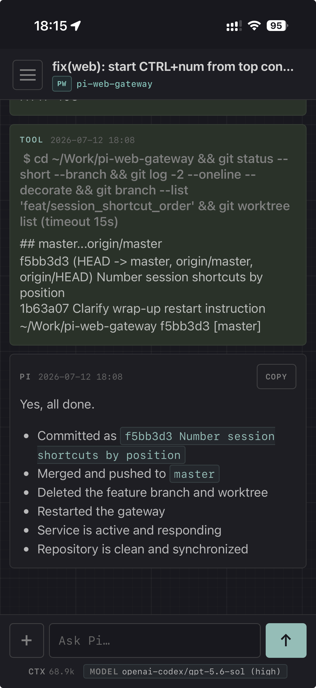

# Pi Web Gateway

Use your Pi sessions from the desktop app or a browser, locally or from another machine. Pi runs on the gateway machine with access to its filesystem, repositories, and credentials.


I have not really seen the code (this project is my first attempt to try real vibe-coding), but I do use it daily now, and it works really well for me.

## Usage modes

By default, the gateway runs in single-user mode and shows all Pi sessions to one trusted user. Optional multi-user mode gives each user a personal session key and shows only the sessions associated with that key.

Multi-user mode is intended for trusted users. It does not provide OS-level process, filesystem, or credential isolation, and settings such as the selected model and thinking effort are currently shared between users. See [configuration](docs/configuration.md#common-options) to enable it.

## Install

Requirements:

- [mise](https://mise.jdx.dev/)
- [Pi CLI](https://pi.dev/) available on `PATH`
- Node.js 22.12 or newer for the desktop app
- FUSE 2 for the Linux desktop app (`fuse2` on Arch Linux)

```sh
git clone https://github.com/melounvitek/pi-web-gateway.git
cd pi-web-gateway
mise trust
mise install
mise run setup
```

On first setup, save the generated admin password printed by the command.

Install the recommended desktop app on macOS or Linux:

```sh
mise run desktop-install
```

Start the gateway:

```sh
PI_GATEWAY_HOST=127.0.0.1 mise run start
```

The app `Pi Web Gateway` gets installed. It connects to the running gateway and can switch between multiple gateway servers. You can also use the gateway directly in browser at <http://localhost:4567>.

There is no mobile app, but on iPhone, adding the gateway to the Home Screen with Apple's [Open as Web App](https://support.apple.com/guide/iphone/open-as-web-app-iphea86e5236/ios) flow works nicely:




## Remote access and configuration

Do not expose the gateway directly to the public internet. Anyone with access can view sessions and start Pi processes with the gateway's filesystem and credential access.

- [Example local and remote setups](docs/examples.md)
- [Configuration options](docs/configuration.md)

## Optional Pi setup

If you do not already have a session-naming workflow, consider installing [`@furbyhaxx/pi-session-naming`](https://github.com/furbyhaxx/pi-session-naming):

```sh
pi install npm:@furbyhaxx/pi-session-naming
```

## Note

This project is written in Ruby, because I am a Ruby developer trying full vibe-coding for the first time, and I expected I might need to jump in. It turned out that was not needed, so I have mostly stayed out of the generated code -- so please, do not treat it as a sample of my usual Ruby style. It very likely is not :-).

## Development

```sh
mise run dev
mise run test
```
