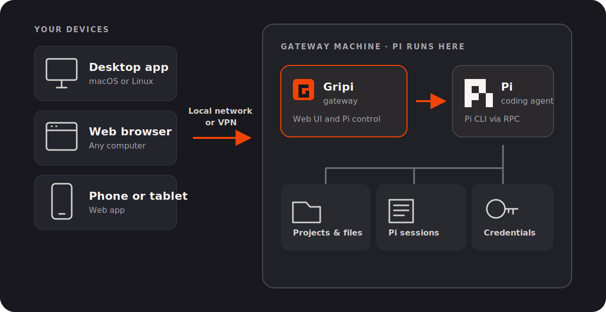
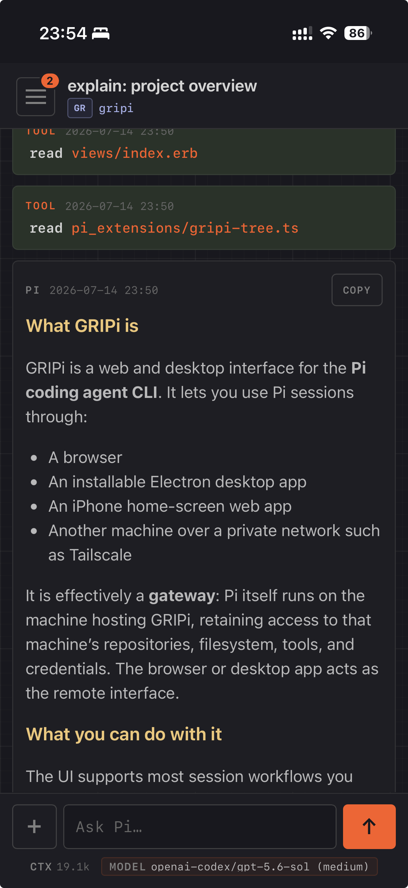

<p align="center">
  <picture>
    <source media="(prefers-color-scheme: dark)" srcset="branding/gripi-wordmark-dark.svg">
    
  </picture>
</p>

**GRIPi is a desktop and web portal for [Pi](https://pi.dev/), powered by a self-hosted gateway.** Run the gateway on a development machine or home server with Pi CLI installed, then use Pi from the desktop app or any web browser—locally or over a private network.

<a href="docs/images/gripi-architecture.svg"></a>

## Install

Requirements:

- [mise](https://mise.jdx.dev/)
- [Pi CLI](https://pi.dev/) available on `PATH`

```sh
git clone https://github.com/melounvitek/gripi.git
cd gripi
mise install
mise run setup
```

Setup stores an admin password in `~/.config/gripi/env` and prints it. Start the gateway:

```sh
GRIPI_HOST=127.0.0.1 mise run start
```

Open <http://localhost:4567> and use the admin password to approve your browser.

### Desktop app

The recommended desktop app is available on macOS and Linux. Installing it requires Node.js 22.12 or newer and, on Linux, FUSE 2 (`fuse2` on Arch Linux).

```sh
mise run desktop-install
```

The desktop app connects to the running gateway and can store and switch between multiple gateways.


There is no mobile app, but on iPhone, adding the gateway to the Home Screen with Apple's [Open as Web App](https://support.apple.com/guide/iphone/open-as-web-app-iphea86e5236/ios) flow works nicely:




## Usage modes

By default, the gateway runs in single-user mode and shows all Pi sessions to one trusted user. Optional multi-user mode gives each user a private user token and shows only the sessions associated with that token.

Multi-user mode is intended for trusted users. It does not provide OS-level process, filesystem, or credential isolation, and settings such as the selected model and thinking effort are currently shared between users. See [configuration](docs/configuration.md#multi-user-mode) to enable it.

## Remote access and configuration

Do not expose the gateway directly to the public internet. Anyone who can use it can start Pi processes with the gateway machine's filesystem and credentials.

- [Example local and remote setups](docs/examples.md)
- [Configuration options](docs/configuration.md)

## Optional Pi setup

If you do not already have a session-naming workflow, consider installing [`@furbyhaxx/pi-session-naming`](https://github.com/furbyhaxx/pi-session-naming):

```sh
pi install npm:@furbyhaxx/pi-session-naming
```

## Note

This project is written in Ruby, because I am a Ruby developer trying full vibe-coding for the first time, and I expected I might need to jump in. It turned out that was not needed, so I have mostly stayed out of the generated code -- so please, do not treat it as a sample of my usual Ruby style. It very likely is not :-).

## Development

```sh
mise run dev
mise run test
```
